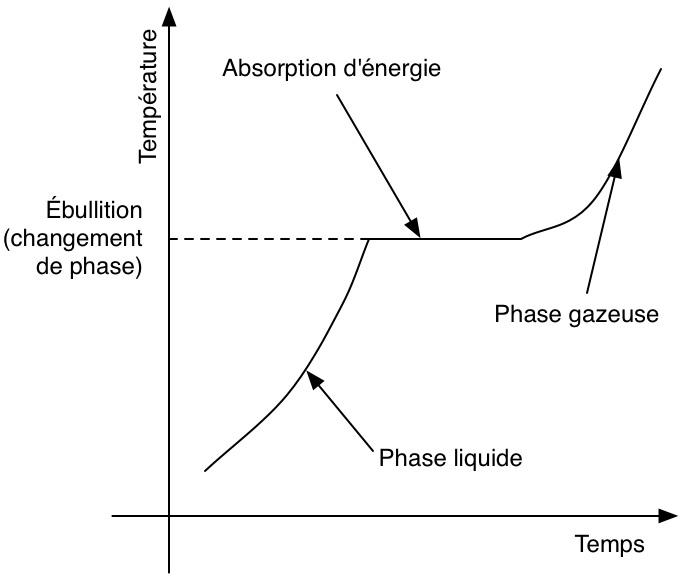
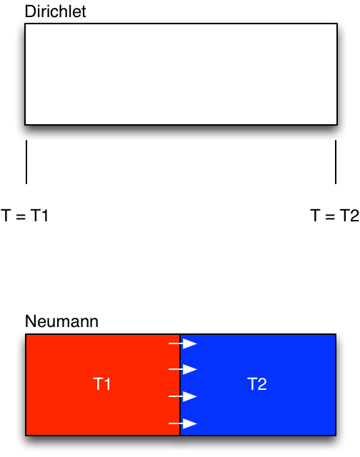
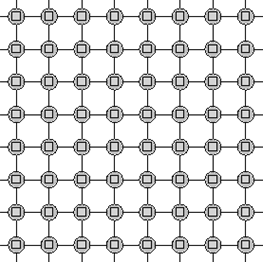
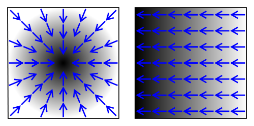
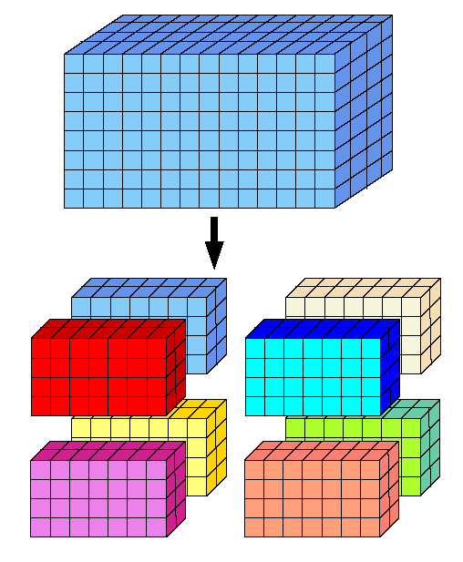
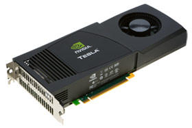

# La simulation numérique 2/2

Tout d'abord, j'aimerais faire un petit retour sur le précédent podcast dédié à la simulation numérique. Dans celui-ci, nous avions abordé différents aspects : nous avions tout d'abord parlé des modèles. J'avais expliqué qu'ils sont une simplification de la réalité permettant d'en garder les éléments importants pour l'étude théorique et la simulation (comme le graphe pour le chemin permettant de passer sur les ponts de la ville de Königsberg décrit dans l'épisode de Robin). Nous avions ensuite parlé du fait que la simulation numérique permet une grande reproductibilité pour des phénomènes complexes. Qu'ils soient habituellement testé via des maquettes (comme pour les avions ou les voitures par exemple), voire impossible à expérimenter (comme la prévision du temps ou encore la cosmologie). Dans la foulée j'avais présenté l'apport de la simulation numérique et notamment des méthodes de Monté-Carlo? Nous avions d'ailleurs abordé la première simulation réalisée par l'équipe de John Van Neumann et j'avais fini sur quelques digressions concernant l'intérêt d'une bonne source de nombres aléatoires.

Dans ce podcast j'avais mentionné le fait qu'un pas nécessaire pour la réalisation de simulations numériques était celui de la discrétisation des domaines d'étude. En fait cette discrétisation s'accompagne aussi de celle des équations du modèle du phénomène que l'on veut simuler : équation de la chaleur quand on cherche par exemple à savoir comment elle se transmet dans un chauffage ou l'équation de l'élasticité quand on veut savoir comment un pont se comporte.

Dans cet épisode nous allons voir les étapes pour "informatiser ces modèles" via la discrétisation, les problèmes auxquels on fait face et ce que l'informatique a développé comme solution pour aider au traitement de ces problèmes mathématiques, au niveau logiciel comme matériel.

## Retour sur pourquoi on simule sur ordinateur

Il faut bien comprendre un point important : on fait de la simulation sur ordinateur parce que les problèmes que l'on souhaite résoudre sont trop complexes pour être résolus "à la main" par le calcul. Les équations qui sont enseignées au lycée ou dans les classes supérieures ne sont en fait que celles pour lesquelles on peut dire quelque chose, parce qu'elles sont simples. Mais dans la vraie vie, les modèles que l'on doit utiliser, pour être réalistes, sont loin des cas d'école. Bien au contraire, ces équations simples ne sont que des cas très particuliers qui aident seulement à comprendre les mécanismes de base en jeu. C'est un peu ce qu'expliquait Robin dans un de ses dossiers sur la plupart des courbes à propos desquelles on ne sait quasiment rien dire. Et bien là c'est un peu pareil.

Les équations des modèles que l'on utilise sont tellement complexes qu'on ne connaît jamais de solution exacte que la résolution à la main (comme on le fait pour des équations du second degré comme on nous l'a appris au lycée par exemple) nous donnerait. 

Comme je l'avais expliqué dans le premier épisode sur la simulation numérique, la discrétisation est obligatoire pour qu'un ordinateur puisse être utilisé : cela permet de découper en plein de petits morceaux indépendants et en nombre fini les problèmes. Ils peuvent être ainsi traités par une machine qui ne peut pas travailler sur le continu (une ligne va posséder une infinité de points et sa version discrétisée un nombre fini) mais uniquement sur du discret.

Il existe tout un tas de méthodes de discrétisation, et pour bien expliquer le principe de fonctionnement, nous aborderons l'une des plus répandues qui se nomme la méthode des différences finies. 

Mais avant toute chose, il faut bien comprendre que ces méthodes ne permettent pas de tout traiter. C'est comme pour les modèles : elles sont valables et valides dans certains cadres. Quand les équations sont trop chaotiques, que des phénomènes de seuil critique (en dessous, rien ne se passe, et au-dessus on voit apparaître quelque chose comme pour une casserole d'eau que l'on chauffe), de saturation (au-dessus d'un seuil le comportement observé ne change pas comme par exemple dans l'électronique où les systèmes ont des domaine de fonctionnement) ou d'hystérésis (une valeur d'entrée, qu'elle soit attente en accélération ou en décélération va donner deux sorties différentes, comme avec des phénomènes visco-élastique où l'on note de la perte d'énergie par exemple) apparaissent, on arrive à leurs limites.

Dans tout ces phénomènes, il est question de la limite de la notion de linéarité : quand on en met deux fois plus en entrée, on en a deux fois plus à la sortie. Chose que n'est plus respecté avec ces histoires de seuil critique ou de saturation.

Et un gros problème des modèles d'aujourd'hui c'est qu'ils sont très hautement non-linéaires. C'est pourquoi avant toute chose, on va essayer de linéariser ces équations complexes en enlevant les termes qui ne sont pas représentatifs (on néglige souvent les frottements de l'air quand on modélise un pendule par exemple) ou en prenant des approximations pour des cas plus simples (pour modéliser un pont on va considérer des petites déformations), d'oû proviennent souvent les non-linéarités.

Ces non-linéarités qui apparaissent dans les équations sont la source d'un grand nombre de sujets abordés par la théorie du Chaos. On peut citer un grand nombre de phénomènes dont les non-linéarités sont la normale : Les frottements de l'air quand ils ne sont pas négligés pour un pendule vont par exemple augmenter en fonction de sa vitesse par exemple Quand on chauffe de l'eau, à partir d'une certaine température de la convection apparaît au sein du liquide (le chaud monte et le froid descend) et si la température augmente encore, des vibrations apparaîssent au sommet des rouleaux de convection. Lorsqu'on remue du sable avec un baton par exemple, la résistance au déplacement augmente avec la vitesse. Le Chaos doit vraiment être un sujet pour un prochain podcast, il est partout!. Un bon livre sur la question, a été d'ailleurs écrit par James Gleick [^gleick].

Le travail que l'on fait finalement quand on part de zéro est donc le suivant :

 1. On définit les équations du modèle qui représente le phénomène que l'on souhaite étudier avec ses conditions aux limites (que se passe-t-il sur les bords du pont dont on souhaite modéliser le comportement par forts vents)
 2. On transforme le problème décrit par un modèle en quelque chose de résolvable par un ordinateur
 3. On assure que la méthode de discrétisation est capable de fournir une solution unique (sinon ça sert pas à grand chose, dans la vraie vie, on a pas plusieurs choix possibles)
 4. On choisit et exécute un algorithme qui est capable de résoudre ce problème

## Définition du domaine

On a déjà parlé dans le premier volet de ce que l'on entend par modèle. Un point qu'il est important de préciser, c'est qu'il faut expliquer sur quel domaine ce modèle va s'appliquer (on peut voir en physique par exemple que les théories de la relativité générale et celle de la mécanique quantique par exemple n'ont pas le même domaine d'application) et avec quelles conditions aux limites (sur les bords du domaine)/initiales (au début de la simulation si elle évolue dans le temps par exemple).

Assez souvent on va donc donner les équations qui s'appliqueront sur le domaine et on parlera des conditions aux limites pour dire ce qu'il se passe sur les "bords" : une poutre est fixée à un mur et si l'on étudie sa déformation, la condition au niveau du mur est qu'à cet endroit elle ne se déforme pas; si l'on souhaite étudier la température de l'eau que l'on chaufferait dans un tube en cuivre (comme dans une chaudière), à l'entrée du tube l'eau à une température et une certaine vitesse et on chauffe un côté du tube avec une certaine température. Ici la vitesse et les deux températures sont des conditions aux limites.

Ces conditions aux limites vont être ainsi de deux types [^condlimiteswp] :

 * *Les conditions aux limites en temps* : on prend par exemple pour la prévision du temps les conditions de température ou de pression à un instant $t$ et on fait évoluer à partir de ces conditions.
 * *Les conditions aux limites en espace* : les deux plus classiques sont les suivantes :
    * Condition aux limites de Dirichlet[^conddirichletwp] : Un exemple est la valeur de la température aux extrémités d'une barre dans laquelle on voudrait connaître la répartition de chaleur.
    * Conditions aux limites de Neumann[^condneumannwp] : Un exemple, toujours avec l'équation de la chaleur où deux corps avec des températures différentes et il y a un flux de chaleur constant du corps le plus chaud vers le plus froid.

    
## Différences finies

Les équations dont je parlais plus tôt, sont des équations dites différentielles : elles sont en fait une relation entre, par exemple, un déplacement, la vitesse et l'accélération ou encore entre la température et son gradient (sa variation sur une distance).

Ces différents concepts seront ce que l'on appelle des dérivées : la dérivée dans le temps du mouvement, c'est sa vitesse. Et la dérivée dans le temps de la vitesse, c'est l'accélération. Pareil pour la dérivée en espace d'une température, c'est son gradient.

Si on veut trouver le déplacement ou la température qui est solution d'une équation différentielle, on va déjà devoir trouver un moyen d'enlever les vitesses, les gradients et tous les trucs du genre et remplacer tout ça par quelque chose qui sera fonction du déplacement ou de la température.

Et bien le rôle de la méthode des différences finies est justement celui-ci : exprimer ces vitesses, gradients, etc en fonction du déplacement ou de la température. Il est par contre clair : l'usage des différences finies ne donnera que des solutions approchées ! 

Ce mot différences finies est un peu barbare, mais en fait, quand on y réfléchit bien, on fait des choses à peu près similaire tout les jours. 

Quand on calcul une vitesse, on se demande quelle distance on a parcouru entre deux moments et on fait la division. Il s'agit d'une vitesse moyenne. Et pour se rapprocher de la vitesse dite "instantanée", on diminue l'intervalle de temps le plus possible. Cette vitesse instantanée c'est justement la "dérivée" du déplacement.

Pour l'accélération on fait la même chose que pour obtenir la vitesse (c'est un peu une vitesse de vitesse), et pour le gradient de température, il s'agit d'observer la différence de température entre deux points de l'espace.

Et bien les différences finies vont être aux dérivées, ce que les vitesses moyennes vont être aux vitesses instantanées.

Comme on l'a dit, pour que l'ordinateur puisse nous aider, il faut "discrétiser" les domaines d'études; c'est-à-dire découper en plein de petits morceaux. Pour calculer les différences finies on prendra ainsi les valeurs aux points de ce maillage (le résultat de la discrétisation du domaine continu).

Ainsi pour chaque point du domaine, on aura remplacé dans l'équation dont on souhaite connaître la solution la valeur des dérivées, etc par les différences finies correspondantes. 

Si on prend toutes ces relations, on se retrouve avec un gros système d'équations que l'on va résoudre comme on le fait au collège et au lycée. C'est ce système d'équations, que l'on appelle aussi système linéaire et que l'on cherche ensuite à résoudre avec des algorithmes.

### Un peu d'histoire sur les différences finies

Pour information [^pauillac] : à partir du 18ème siècle, des mathématiciens se sont mis à utiliser des différences finies pour mettre en place des abaques notamment pour les logarithmes et la trigonométrie qui étaient utilisés pour le cadastre, la navigation, l'artillerie, les statistiques, le calcul d'intérêts ou encore l'astronomie. En effet, pour approcher ces fonctions, on peut les approcher par une combinaison linéaire des différentes dérivées première, seconde, etc qui seront de leur côté approchées par des différences finies.

Comme tout cela nécessitaient de grands nombres d'opérations de calcul, des mathématiciens et inventeurs se sont mis à tenter la mise en place de machines permettant le calcul "automatique" de ces différences finies. Le premier à presque y arriver fut Charles Babbage entre 1820 et 1843 (il n'y arriva pas complètement) et le Suédois George SCHEUTZ (1785-1873) y arriva en 1840. A savoir que ce type de machine a été utilisé jusque dans les année 1930.

### Remarques et limitations

L'un des problèmes des différences finies vient du maillage qui est forcément à base de carrés, de rectangles ou tout du moins de parallélogrammes. Ceci ne permet pas d'approcher de manière assez efficace des formes qui peuvent être complexes (pour un cercle par exemple, on va retrouver assez peu de points qui seront sur la frontière et qui permettront donc d'exprimer les conditions aux limites).

#### Ouverture vers d'autres méthodes

A partir des années 50-60, d'autres méthodes ont aussi été développées pour donner un cadre mathématique plus rigoureux qui permette d'assurer (par des démonstrations) l'obtention d'une solution qui ait du sens, que les algorithmes vont être stables et ne vont pas donner n'importe quoi, etc. Elles venaient notamment de la mécanique du solide.

De plus, là où les différences finies ne vont s'intéresser qu'aux points du maillages, D'autres méthodes plus récentes vont plutôt chercher à donner les solutions le long des lignes reliant les points du maillage (avec des triangles par exemple et plus des parallélogrammes), voire même au sein de volumes autour de ces points.

## Résolution de systèmes linéaires

Une fois que ces méthodes de discrétisation nous ont permis d'obtenir un système d'équations, ou système linéaire à résoudre, il est nécessaire de mettre en place des algorithmes de résolution du système obtenu.

Il existe ainsi différentes méthodes que l'on pourra classer dans deux grandes catégories : Les méthodes directes [^directmeth] et les méthodes itératives [^itermethwp]

### Les méthodes directes

Les méthodes directes permettent théoriquement d'aboutir à la solution exacte du système linéaire.

La plus classique est celle dite du pivot de Gauss ou d'élimination de Gauss-Jordan. Le but est en fait de se débrouille en différentes étapes à résoudre le systèmes d'équation comme on le fait à l'école quand on avait un système de deux équations. 

On a deux équations avec deux inconnues, on exprime la première inconnue en fonction de l'autre avec la première équation, et on remplace cette inconnue dans la seconde équation pour trouver la deuxième inconnue. Ensuite on met la valeur trouvée pour la seconde inconnue dans la relation avec la première inconnue et on a trouver nos deux valeurs.

Et bien le principe est le même, mais avec les inconnues qui vont être les valeurs de la solution aux points du maillage et le système d'équations que l'on a obtenu plus tôt.

Le problème de ces méthodes, c'est qu'elles peuvent être longues (on doit faire autant d'étapes que d'inconnues dans le système) et qu'elles peuvent amener des problèmes numériques pendant la résolution (notamment quand on va devoir diviser par des nombres petits, des choses comme ça parce que les ordinateurs font des calculs approchés, en effet 1/3 c'est 0,33 avec un nombre fini de 3), même si à priori elles permettent d'obtenir la solution exacte.

### Les méthodes itératives

Celles-ci proposent de partir d'une solution initiale et d'ensuite chercher à se rapprocher de la vraie solution en regardant à chaque itération si on s'en rapproche ou on s'en éloigne.

La plupart de ces méthodes, dites de Krylov[^krylovwp], ont pour but de calculer à chaque étape un gradient qui va donner la direction dans laquelle aller pour se rapprocher de la solution. En fait, à chaque étape il va littéralement nous dire si on chauffe ou si on refroidit (comme pour le gradient de température)!

Comme on se rapproche, au fur et à mesure des étapes, de la solution, on peut se fixer une précision à partir de laquelle on va s'arrêter. Ainsi on n'ira pas jusqu'à un nombre d'itérations qui correspond à la taille du problème. C'est pour cela qu'elles sont souvent utilisées à la place des méthodes dites directes car elles sont vues comme plus rapides.

## Parallélisation et décomposition de domaine

Quand les systèmes linéaires à résoudre deviennent trop gros (ils ne tiennent plus en mémoire) et que l'on a à disposition des serveurs informatiques avec de multiples processeurs, voire même plusieurs serveurs informatiques, on peut tenter de paralléliser ces algorithmes.

Une littérature abondante existe sur la question, et on peut faire ce que l'on appelle de la décomposition de domaine par exemple[^ddmwp]. Si on dispose de quatre processeurs et que l'on veut simuler la modification de structure d'un avion en vol, on va par exemple faire calculer la solution sur chaque aile à l'un d'entre eux et on va couper le fuselage en deux pour le distribuer entre les deux processeurs restant.

Dans ces cas-là il devient important de bien découper ces problèmes pour qu'aux frontières tout se passent bien (je rappelle que l'on calcule les solutions aux points des maillages et que si ils ne coincident pas on peut commencer à avoir des problèmes) avec un peu de recouvrement pour que les informations de la solution à chercher puissent se propager entre les "domaines".

Ces méthodes de découpage du domaines en différents sous-éléments qui seront répartis sur des processeurs ou des serveurs vont impliquer des temps de communication pour transférer les informations aux frontières de chacun de ces sous-domaines. Et si l'on découpe trop, il peut arriver que l'algorithme global passe plus de temps à transférer des données qu'à calculer effectivement. Il est donc bon de découper de manière efficace son domaine et d'essayer de "recouvrir" le temps passé à communiquer des informations par du calcul.

## Les solutions informatiques qui existent et les problèmes afférents

Il existent une grande quantité de librairies logicielles qui existent pour réaliser ces différentes opérations, les plus connues se nomment BLAS[^blas]  (pour Basic Linear Algebra Solvers), Linpack, LAPACK[^lapack]  (pour Linear Algebra Package), Scalapack [^scalapack], Magma [^magma], etc qui fournissent des outils pour résoudre des parties des problèmes informatiques.

A savoir que ces librairies ont été écrites en Fortran pour les plus anciennes [^fortranwp], l'un des tout premiers langages informatiques de haut-niveau créé dans les années 50 et encore toujours roi dans le monde de la simulation informatique.

Je n'en ai pas forcément beaucoup parlé, mais les aspects matériel et logiciel ont évolué de manière conjointe. 

Comme je l'expliquais, on est passé de discrétisation avec des différences finies et des méthodes peu gourmande en mémoire dans les années 50-60 (on faisait avec ce que l'on avait), à des méthodes plus complexes, plus précises, mais aussi plus gourmandes en mémoire et en espace disque par la suite. On a vu aussi grandir les maillages qui n'avait que de petites tailles (toujours pour des histoires de limitation de taille mémoire et disque) à des problèmes qui font maintenant plusieurs dizaines voire centaines de millions d'inconnues et qui prennent ainsi plusieurs giga-octets de RAM.

On a aussi du paralléliser les algorithmes pour pouvoir tirer partie des super-calculateurs et de leur puissance répartie. Et maintenant on en vient même à utiliser des cartes graphiques de manière massive pour leur capacité de traitements parallèles très importante.

Petite anecdote marrante : en 2006 j'ai fait un stage dans une société qui développait des logiciels de simulation et un cas marquant était celui de la simulation du décollage d'un hélicoptère à turbo-réacteurs. Le calcul était tellement complexe qu'il fallait près de 24 heures pour que le logiciel simule quelques dixièmes de seconde avant d'exploser sur près de 50 serveurs ! Comme il était possible de consever des étapes intermédiaires avant que le modèle explose, on repartait de ces étapes pour continuer.

C'est dire la complexité des modèles considérés et des contraintes informatiques (autant logicielles que matérielles) qui existent !

D'ailleurs un des problèmes qui est apparu est celui des données. J'ai parlé lors du précédent podcast de la simulation de l'univers, avec les données gigantesques utiles produites (1,5 peta-octet utile). Ce qu'il faut savoir c'est qu'il y a eu près de 100x plus de données générées qu'il a fallu trier !!!

## Les cartes graphiques pour aider dans la simulation

Quelque chose qui s'est développé ces dernières années a notamment été l'usage des cartes graphiques pour aider au calcul. En tant que solution de traitement parallèle massif, les GPUs de ces cartes peuvent avoir de vrais atouts.

Il y a quand même quelques inconvénients : Avant qu'OpenCL[^openclwp]  (une norme définissant la façon de développer des logiciels utilisant des GPUs qui se veut indépendantes des cartes graphique utilisées) n'arrive, voire même CUDA [^cudawp] avant lui (deux "langages dédié à l'usage de GPU" dont le dernier est spécifique aux cartes NVidia) il était nécessaire de manier les structures de données propres aux jeux vidéos pour en tirer partie. Ce n'était pas très évident et plus du domaine de la bidouille qu'autre chose. 

Maintenant cela est plus simple car s'est développé un eco-système logiciel qui va permettre de développer son logiciel avec certaines directives spécifiques : autour d'une boucle d'opérations indépendantes on va dire que cela peut être déployé sur tous les processeurs du GPU par exemple. Celui-ci sera compilé de telle manière que l'application produite, quand elle arrivera à ces directives, saura comment faire pour exploiter la puissance du GPU. Et un certain nombre de code de calcul se mettent à en tirer partie. Cependant les limitations en terme de mémoire de ces cartes (si on a plus de données que la place disponible dans la carte, on va adresser la mémoire centrale de l'ordinateur et l'on perd tout l'intérêt du point de vue temps d'accès, on va chercher des données et les ramener sur la carte graphique) et de précision numérique (les cartes ne calculent qu'avec des entiers de base et pas des nombres réels vu qu'elles servent plutôt à manier des pixels normalement) font que les performances mirobolantes annoncées par Nvidia notamment, en font revenir plus d'un vers le calcul plus classique.

Une des alternatives qui commence à arriver serait l'usage (comme il y a bien longtemps) de co-processeurs spécialisés à cette tâche comme les Xeon-Phi[^xeonphi] de chez Intel. Le but du Xeon Phi, est de fournir un équivalent de GPU (en terme de puissance, de nombre de coeur, etc) mais avec la même architecture logicielle que les processeurs classiques (x86). En fait l'idée est que l'on puisse se passer des surcouches logicielles dont on se sert pour adapter une application pour des GPUs classiques.

Il est intéressant de noter que le principe des co-processeurs est un peu celui des cartes graphiques : avoir un processeur dédié à des tâches précises (ici le calcul des pixels qui seront affichés sur l'écran). C'est quelque chose qui s'est développé dans les années 70 jusqu'à la fin des années 90 pour différents cas d'usage : les mainframe, ces ordinateurs énormes qui servaient par exemple pour maintenir les systèmes comptables, utilisaient des co-processeurs qui géraient les écritures et lectures de données. 

Ces co-processeurs on été réintégrés dans le processeur principal à partir de 2000 et finalement on voit qu'ils réapparaîssent de nouveau. Comme quoi, tout comme la mode, dans l'informatique, les choses vont et viennent de manière cyclique.

Les bibliothèques comme Magma que j'ai brièvement cité plus haut viennent remplacer les librairies vieillissantes comme Lapack en prenant en compte ces accélérateurs (co-processeurs, cartes graphiques, etc) pour la résolution des systèmes linéaires considérés. Elles permettent ainsi de facilement prendre en compte les nouveaux matériels disponibles cités ci-dessus sans trop se prendre la tête.

## Linpack, le top500, le green500

Un effet collatéral étonnant a été l'usage de la bibliothèque Linpack pour évaluer la performance crête des super-calculateurs. L'idée était en effet de mesure la performance des systèmes informatiques pour la résolution d'un système linéaire basé sur les fonctions fournies par la bibliothèque.

Pendant longtemps ce logiciel a été à la base du Top500[^top500], le classement des 500 calculateurs les plus puissants du monde. Puis avec l'avènement des cartes graphiques et les problématiques de grandes données qui ne sont pas très bien prises en compte par ce test[^linpacklim], différents autres classements sont apparus. Le Green500 [^green500] est l'un d'entre eux et il vise plutôt à estimer la performance énergétique d'un système informatique que sa puissance brute.

### Green500 et performance énergétique

A noter par exemple que Tianhe-2, la machine la plus puissante du monde, possède presque 3 millions de coeurs dont une grande partie correspond à des co-processeurs xeon phi possédant chacun 57 coeurs mais avec une performance énergétique (puissance Linpack sur consommation énergétique) en retrait (1900 MFlops/W il s'agit du nombre d'opérations en virgule flottante que l'on peut faire avec un Watt).

Au contraire la machine détenue par le centre de calcul du ROMEO en Champagne-Ardennes est classée 5ème du green500 et possède une très bonne performance énergétique (3130 MFlops/W).

Il est en effet devenu crucial de gérer correctement les problématiques d'énergie. En effet la puissance de calcul grandissante de ces moyens informatiques va de paire avec une consommation énergétique qui grimpe en flèche. Et ceci sans parler de la consommation électrique des climatisations nécessaires pour refroidir les serveurs. Pour info, aujourd'hui, il faut quasiment autant d'énergie pour la climatisation que pour les serveurs.

Avec près de 17 000 coeurs de calcul et 20 Peta-octets de stockage sur disque et sur bande au CC-IN2P3[^ccin2p3]  (le centre de calcul qui possédait les données du LHC concernant le boson de Higgs), il est nécessaire de disposer d'une alimentation de plusieurs mégawatts !

# Conclusions

Voilà, j'ai tenté de dresser un panorama de ce que me semble être la simulation numérique avec :

 * Un premier podcast plutôt général sur la simulation, les problématiques auxquelles elle tente de répondre, avec quelques exemples et notamment la première qui fut mise en place dans les années 50.
 * Un second plutôt cette fois orienté sur les aspects mathématiques et informatiques, un exemple de méthode de discrétisation, ce que l'on utilise pour mettre en oeuvre ces outils sur des serveurs et finalement quelques digressions plus large sur les impacts des technologies dans le domaine.

Il est finalement important de voir que la simulation :

* Est indispensable pour la science d'aujourd'hui pour continuer de comprendre les phénomènes qui nous entoure, et que cela ne va pas aller en diminuant
* Est la source de nouveaux challenges qui ont des impacts dans nos vies de tous les jours (Cloud, Big Data, etc)
* Est sortie depuis longtemps du domaine scientifique. Le monde du jeu vidéo profite depuis quelques années des avancées dans ce domaine: MS Flight Simulator était l'un des premiers, maintenant on parle notamment de moteur physique, de simulation de vagues, etc. GTA IV en est un des exemples les plus récents.

En espérant que vous aurez appris plein de choses et que vous aurez trouver cela intéressant, je vous remercie de m'avoir laissé en parlé :)

[^siminfowp]: [http://fr.wikipedia.org/wiki/Simulation_informatique](http://fr.wikipedia.org/wiki/Simulation_informatique)
[^princsuppwp]: [http://fr.wikipedia.org/wiki/Principe_de_superposition](http://fr.wikipedia.org/wiki/Principe_de_superposition)
[^formtaylorwp]: [http://fr.wikipedia.org/wiki/Th%C3%A9or%C3%A8me_de_Taylor](http://fr.wikipedia.org/wiki/Th%C3%A9or%C3%A8me_de_Taylor)
[^brooktaylorwp]: [http://fr.wikipedia.org/wiki/Brook_Taylor](http://fr.wikipedia.org/wiki/Brook_Taylor)
[^williamyoungwp]: [http://fr.wikipedia.org/wiki/William_Henry_Young](http://fr.wikipedia.org/wiki/William_Henry_Young)
[^condlimiteswp]: [http://fr.wikipedia.org/wiki/Condition_aux_limites](http://fr.wikipedia.org/wiki/Condition_aux_limites)
[^dirichletwp]: [http://fr.wikipedia.org/wiki/Dirichlet](http://fr.wikipedia.org/wiki/Dirichlet)
[^carlneumannwp]: [http://fr.wikipedia.org/wiki/Carl_Neumann](http://fr.wikipedia.org/wiki/Carl_Neumann)
[^eqintegwp]: [http://fr.wikipedia.org/wiki/%C3%89quation_int%C3%A9grale](http://fr.wikipedia.org/wiki/%C3%89quation_int%C3%A9grale)
[^condrobinwp]: [http://fr.wikipedia.org/wiki/Condition_aux_limites_de_Robin](http://fr.wikipedia.org/wiki/Condition_aux_limites_de_Robin)
[^conddirichletwp]: [http://fr.wikipedia.org/wiki/Condition_aux_limites_de_Dirichlet](http://fr.wikipedia.org/wiki/Condition_aux_limites_de_Dirichlet)
[^condneumannwp]: [http://fr.wikipedia.org/wiki/Condition_aux_limites_de_Neumann](http://fr.wikipedia.org/wiki/Condition_aux_limites_de_Neumann)
[^excondrobin]: [http://www.cmi.univ-mrs.fr/~torresan/MathPhy/cours/node16.html#SECTION0033320000000000000000](http://www.cmi.univ-mrs.fr/~torresan/MathPhy/cours/node16.html#SECTION0033320000000000000000)
[^condlimdynwp]: [http://fr.wikipedia.org/wiki/Condition_aux_limites_dynamique](http://fr.wikipedia.org/wiki/Condition_aux_limites_dynamique)
[^diffinies]: [http://pauillac.inria.fr/~weis/info/histoire_de_l_info.html](http://pauillac.inria.fr/~weis/info/histoire_de_l_info.html)
[^docinsa]: [http://docinsa.insa-lyon.fr/polycop/download.php?id=104080&id2=1](http://docinsa.insa-lyon.fr/polycop/download.php?id=104080&id2=1)
[^volfiniswp]: [http://fr.wikipedia.org/wiki/M%C3%A9thode_des_volumes_finis](http://fr.wikipedia.org/wiki/M%C3%A9thode_des_volumes_finis)
[^difffinwp]: [http://fr.wikipedia.org/wiki/Diff%C3%A9rence_finie](http://fr.wikipedia.org/wiki/Diff%C3%A9rence_finie)
[^navierstokeswp]: [http://fr.wikipedia.org/wiki/%C3%89quations_de_Navier-Stokes](http://fr.wikipedia.org/wiki/%C3%89quations_de_Navier-Stokes)
[^pauillac]: [http://pauillac.inria.fr/~weis/info/histoire_de_l_info.html](http://pauillac.inria.fr/~weis/info/histoire_de_l_info.html)
[^difffinwp2]: [http://fr.wikipedia.org/wiki/M%C3%A9thode_des_diff%C3%A9rences_finies](http://fr.wikipedia.org/wiki/M%C3%A9thode_des_diff%C3%A9rences_finies)
[^emformwp]: [http://fr.wikibooks.org/wiki/M%C3%A9thode_des_%C3%A9l%C3%A9ments_finis/Formulation](http://fr.wikibooks.org/wiki/M%C3%A9thode_des_%C3%A9l%C3%A9ments_finis/Formulation)
[^emrappelswp]: [http://fr.wikibooks.org/wiki/M%C3%A9thode_des_%C3%A9l%C3%A9ments_finis/Rappels_de_m%C3%A9canique](http://fr.wikibooks.org/wiki/M%C3%A9thode_des_%C3%A9l%C3%A9ments_finis/Rappels_de_m%C3%A9canique)
[^empreswp]: [http://fr.wikibooks.org/wiki/M%C3%A9thode_des_%C3%A9l%C3%A9ments_finis/Pr%C3%A9sentation_g%C3%A9n%C3%A9rale](http://fr.wikibooks.org/wiki/M%C3%A9thode_des_%C3%A9l%C3%A9ments_finis/Pr%C3%A9sentation_g%C3%A9n%C3%A9rale)
[^efmwp]: [http://fr.wikipedia.org/wiki/M%C3%A9thode_des_%C3%A9l%C3%A9ments_finis](http://fr.wikipedia.org/wiki/M%C3%A9thode_des_%C3%A9l%C3%A9ments_finis)
[^dynastruct]: [http://laurent.baillet.voila.net/cours_Dyna_struct.pdf](http://laurent.baillet.voila.net/cours_Dyna_struct.pdf)
[^divergencewp]: [http://fr.wikipedia.org/wiki/Divergence_(analyse_vectorielle)](http://fr.wikipedia.org/wiki/Divergence_(analyse_vectorielle))
[^fluxdivwp]: [http://fr.wikipedia.org/wiki/Th%C3%A9or%C3%A8me_de_flux-divergence](http://fr.wikipedia.org/wiki/Th%C3%A9or%C3%A8me_de_flux-divergence)
[^directmeth]: [http://sfb649.wiwi.hu-berlin.de/fedc_homepage/xplore/ebooks/html/csa/node37.html](http://sfb649.wiwi.hu-berlin.de/fedc_homepage/xplore/ebooks/html/csa/node37.html)
[^itermethwp]: [http://en.wikipedia.org/wiki/Iterative_method](http://en.wikipedia.org/wiki/Iterative_method)
[^cranicwp]: [http://en.wikipedia.org/wiki/Crank%E2%80%93Nicolson_method](http://en.wikipedia.org/wiki/Crank%E2%80%93Nicolson_method)
[^rkwp]: [http://en.wikipedia.org/wiki/Runge%E2%80%93Kutta_methods](http://en.wikipedia.org/wiki/Runge%E2%80%93Kutta_methods)
[^eulerwp]: [http://en.wikipedia.org/wiki/Backward_Euler_method](http://en.wikipedia.org/wiki/Backward_Euler_method)
[^krylovwp]: [http://en.wikipedia.org/wiki/Krylov_subspace](http://en.wikipedia.org/wiki/Krylov_subspace)
[^gcwp]: [http://en.wikipedia.org/wiki/Conjugate_gradient](http://en.wikipedia.org/wiki/Conjugate_gradient)
[^adiwp]: [http://en.wikipedia.org/wiki/Alternating_direction_implicit_method](http://en.wikipedia.org/wiki/Alternating_direction_implicit_method)
[^ddmwp]: [http://en.wikipedia.org/wiki/Domain_decomposition_methods](http://en.wikipedia.org/wiki/Domain_decomposition_methods)
[^blas]: [http://www.netlib.org/blas/](http://www.netlib.org/blas/)
[^lapack]: [http://www.netlib.org/lapack/](http://www.netlib.org/lapack/)
[^fortranwp]: [http://fr.wikipedia.org/wiki/Fortran](http://fr.wikipedia.org/wiki/Fortran)
[^openclwp]: [http://fr.wikipedia.org/wiki/OpenCL](http://fr.wikipedia.org/wiki/OpenCL)
[^cudawp]: [http://fr.wikipedia.org/wiki/Compute_Unified_Device_Architecture](http://fr.wikipedia.org/wiki/Compute_Unified_Device_Architecture)
[^xeonphi]: [http://www.intel.fr/content/www/fr/fr/processors/xeon/xeon-phi-detail.html](http://www.intel.fr/content/www/fr/fr/processors/xeon/xeon-phi-detail.html)
[^top500]: [http://www.top500.org/](http://www.top500.org/)
[^green500]: [http://www.green500.org/](http://www.green500.org/)
[^linpacklim]: [http://www.zdnet.fr/actualites/supercalculateurs-le-top500-annonce-un-changement-de-methode-de-calcul-39792356.htm](http://www.zdnet.fr/actualites/supercalculateurs-le-top500-annonce-un-changement-de-methode-de-calcul-39792356.htm)
[^ccin2p3]: [http://cc.in2p3.fr/Le-parc-informatique](http://cc.in2p3.fr/Le-parc-informatique)
[^scalapack]: [http://www.netlib.org/scalapack/](http://www.netlib.org/scalapack/)
[^magma]: [http://icl.cs.utk.edu/magma/index.html](http://icl.cs.utk.edu/magma/index.html)
[^gleick]: [James Gleick - La Théorie du Chaos](http://www.amazon.fr/La-th%C3%A9orie-chaos-James-Gleick/dp/2081218046/ref=sr_1_1?ie=UTF8&qid=1389719063&sr=8-1&keywords=james+gleick) 