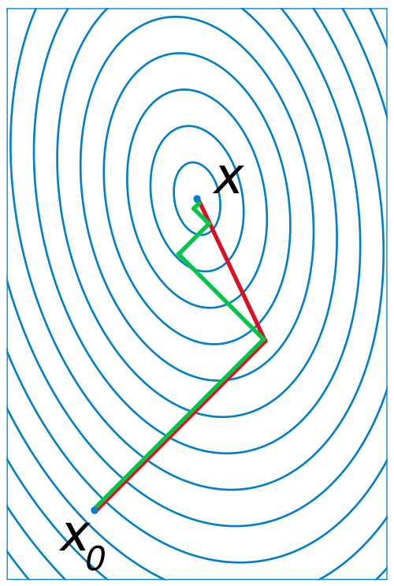

# La simulation numérique 2/2

Tout d'abord, j'aimerais faire un petit retour sur le précédent podcast dédié à la simulation numérique. Dans celui-ci, nous avions abordé différents aspects : nous avions tout d'abord parlé des modèles en expliquant qu'ils sont une simplification de la réalité permettant d'en garder les éléments importants pour l'étude théorique et la simulation (comme le graphe pour le chemin permettant de passer sur les ponts de la ville de Königsberg décrit dans l'épisode de Robin). Nous avions ensuite parlé du fait que la simulation numérique permet une grande reproductibilité pour des phénomènes complexes à tester via des maquettes (comme pour les avions ou les voitures par exemple), voire impossible à expérimenter (comme la prévision du temps ou encore la cosmologie). Dans la foulée j'avais présenté l'apport de la simulation numérique et notamment des méthodes de Monté-Carlo avec la première simulation réalisé par l'équipe de John Van Neumann et quelques digressions sur l'intérêt d'une bonne source de nombres aléatoires.

Dans ce podcast j'avais mentionné le fait qu'un pas nécessaire pour la réalisation de simulation numérique était celui de la discrétisation des domaines d'étude. En fait cette discrétisation s'accompagne aussi de celle des équations du modèle du phénomène que l'on veut simuler : équation de la chaleur quand on cherche par exemple à savoir comment elle se transmet dans un chauffage, équation de l'élasticité quand on veut savoir comment un pont se comporte, etc.

Dans cet épisode nous allons voir les étapes pour "informatiser ces modèles" via la discrétisation, les problèmes auxquels on fait face, ce que l'informatique a développer comme solution pour aider au traitement de ces problèmes mathématiques, au niveau logiciel comme matériel.

## Retour sur pourquoi on simule sur ordinateur

Il faut bien comprendre un point important : on fait de la simulation par ordinateur parce que les problèmes que l'on souhaite résoudre sont trop complexes pour être résolus "à la main" par le calcul. Les équations qui sont enseignées au lycée ou dans les classes supérieures ne sont en fait que celles pour lesquelles on peut dire quelque chose, parce qu'elles sont simples. Mais dans la vraie vie, les modèles que l'on doit utiliser pour être réaliste sont loin des cas d'école. Bien au contraire, ces équations simples ne sont que des cas très particuliers qui aident seulement à comprendre les mécanismes en jeu.

Les équations des modèles que l'on utilise sont tellement complexes qu'on ne connaît jamais de solution exacte que la résolution à la main (comme on le fait pour des équations du second degré comme on nous l'a appris au lycée par exemple) nous donnerait. 

Si on veut modéliser un transfert de chaleur par exemple, l'exemple de base est celui de la conduction dans un barre d'un matériau quelconque. Mais dans la vraie vie, on va avoir aussi d'autres phénomènes : la convection, la radiation, une géométrie qui ressemblera peut-être plus à un radiateur (avec un forme complexe) qu'à une barre en forme de tube plein. 

Comme je l'avais expliqué dans le premier épisode sur la simulation numérique, la discrétisation est obligatoire pour qu'un ordinateur puisse être utilisé : cela permet de découper en plein de petits morceaux indépendants et en nombre fini les problèmes qui peuvent être ainsi traité par une machine qui ne peut pas travailler sur le continu (une ligne va posséder une infinité de points et sa version discrétisée un nombre fini).

Il existe tout un tas de méthodes de discrétisation, nous aborderons l'un des plus répandues qui se nomme la méthode des différences finies. 

Mais avant toute chose, il faut bien comprendre que ces méthodes ne permettent pas de tout traiter. C'est comme pour les modèles, elles sont valables et valides dans certains cadres : quand les équations sont trop chaotiques, que des phénomènes de seuil critique (en dessous, rien ne se passe, et au-dessus on voit apparaître quelque chose), de saturation (au-dessus d'un seuil le comportement observé ne change pas) ou d'hystérésis (une valeur d'entrée, qu'elle soit attente en accélération ou en décélération va donner deux sorties différentes, même si c'est deux fois la même valeur) apparaissent, on arrive à leurs limites.

On parle en fait de linéarité : quand on en met deux fois plus en entrée, on en a deux fois plus à la sortie. Chose que n'est plus respecté avec ces histoires de seuil critique ou de saturation.

Et un gros problème des modèles d'aujourd'hui c'est qu'ils sont très hautement non-linéaire. C'est pourquoi avant toute chose, on va essayer de linéariser ces équations complexes en enlevant les termes qui ne sont pas représentatifs (on néglige souvent les frottements de l'air quand on modélise un pendule par exemple), en prenant des approximations pour des cas plus simples (pour modéliser un pont on va considérer des petites déformations), d'oû provienent souvent les non-linéarités.

Le travail que l'on fait finalement quand on part de zéro est donc le suivant :

 1. On définit les équations du modèle qui représente le phénomène que l'on souhaite étudier avec ses conditions aux limites (que se passe-t-il sur les bords du pont)
 2. On ramène le problème décrit par un modèle à quelque chose de résolvable par un ordinateur
 3. On assure que la méthode de discrétisation est capable de fournir une solution unique (sinon ça sert pas à grand chose, dans la vraie vie, on a pas plusieurs choix possible)
 4. On choisit et exécute un algorithme qui est capable de résoudre ce problème

## Définition du domaine

On a déjà parlé dans le premier podcast de ce que l'on entend par modèle, un point qu'il est important de précisé c'est qu'il faut expliquer sur quel domaine ce modèle va s'appliquer (on peut voir en physique par exemple que les théories de la relativité générale et celle de la mécanique quantique par exemple n'ont pas le même domaine d'application) et avec quelles conditions aux limites (sur les bords du domaine)/initiales (au début de la simulation si elle évolue dans le temps par exemple).

Assez souvent on va donc donner les équations qui s'appliqueront sur le domaine et on parlera des conditions aux limites pour dire ce qu'il se passe sur les "bords" : une poutre est fixée à un mur et si l'on étudie sa déformation, la condition au niveau du mur est qu'à cet endroit elle ne se déforme pas; si l'on souhaite étudier la température de l'eau que l'on chaufferait dans un tube en cuivre (comme dans une chaudière), à l'entrée du tube l'eau à une température et une certaine vitesse et on chauffe un côté du tube avec une certaine température. Ici la vitesse et les deux température sont des conditions aux limites.

Ces conditions aux limites vont être ainsi de deux types [^condlimiteswp] :

 * *Les conditions aux limites en temps* : on prend par exemple pour la prévision du temps les conditions de temppérature de pression à un instant $t$ et on fait évoluer à partir de ces conditions.
 * *Les conditions aux limites en espace* : les deux plus classiques sont les suivantes :
    * Condition aux limites de Dirichlet[^conddirichletwp] : Un exemple est la valeur de la température aux extrémités d'une barre dans laquelle on voudrait connaître la répartition de chaleur.
    * Conditions aux limites de Neumann[^condneumannwp] : Un exemple, toujours avec une barre dont on souhaiterait connaître la répartition de chaleur est le cas où l'on chauffe l'un des côté (on a un flux de chaleur à cette extrémité).
    
### Différences finies

La méthode des différences finies apparaît comme la méthode la plus simple, il s'agit en effet de discrétiser les opérateurs de dérivation/différentiation grâce aux développements de Taylor-Young [^formtaylorwp]  [^brooktaylorwp]. Le mathématicien Brook Taylor établi en 1715 que l'on peut approximer des fonctions suffisamment dérivables au voisinage d'un point par un polynôme dont les coefficients ne dépendent que des dérivées de la fonction en ce point. William Henry Young est arrivé plus tard (1863-1942) lors qu'il travailla sur la théorie de la mesure, les intégrales de Lebesgue etc.

Comme il est question de discrétiser, on peut par exemple regarder ce que cela donne sur un exemple simple :

 * Prenons un segment de longueur 1
 * On le découpe en $n+1$ sous-segments dont le pas sera de $h=1/n$

On a grosso modo trois types de différences[^difffinwp]  [^difffinwp2] : 

 * "en avant" : on prend les valeurs en $x$ et $x+h$
 * "en arrière" : on prend les valeurs en $x-h$ et $x$,
 * "centrées" : on prend les valeurs en $x-h/2$ et $x+h/2$

On aura alors comme approximation pour la dérivée de la fonction en $x$ :

$$ f'(x) = \frac{f(x+h)-f(x)}{h} $$

Ce qui ressemble à l'expression de la dérivée en terme de limite.

En appliquant le même principe à la dérivée première pour obtenir la dérivée second on pour obtenir quelque chose de similaire :

$$ f''(x) = \frac{f(x+h) - 2f(x) + f(x+h)}{h^2} $$

Tout ceci fonctionne bien en dimension 1, mais pour peut que les fonctions soient suffisamment dérivables, cela s'étend très bien aux dimensions supérieures.

On voit donc que l'on a besoin des valeurs en différents points qui vont former le maillage et que l'on obtient une relation assez simple pour l'expression des dérivées première, seconde, etc.

Finalement on se rend compte que si notre équation implique par exemple une combinaison linéaire de la dérivée seconde et de la fonction en tout point du domaine:

$$ \alpha.f'' + \beta.f = \gamma $$

on se retrouve, grâce aux opérateurs discrétisés à n'avoir affaire qu'à un produit de valeurs de la fonction à trouver qui seront prises en des points définis du maillage.

Ainsi pour tous les points du domaine, on a une une relation entre différentes valeurs de la fonction aux points du maillage. Si on représente par un vecteur $f$ dont les différentes valeurs sont celles de la solution aux points du maillage, on peut représenter cela par le produit entre une matrice (qui va exprimer cette relation) et le vecteur qui correspond à la solution. C'est ce système linéaire que l'on cherche ensuite à résoudre avec des algorithmes.

Pour information [^pauillac] : à partir du 18ème siècle des mathématiciens se sont mis à utiliser des développements de Taylor, et donc les différences finies pour mettre en place des abaques notamment pour les logarithmes et la trigonométrie qui étaient utilisés pour le cadastre, la navigation, l'artillerie, les statistiques, le calcul d'intérêts ou encore l'astronomie. Comme ceux-ci nécessitaient de grands nombres d'opérations de calcul, des mathématiciens et inventeurs se sont mis à tenter la mise en place de machines permettant le calcul "automatique" de ces différences finies. Le premier à presque y arriver fut Charles Baggage entre 1820 et 1843 (il n'y arriva pas complètement) et le Suédois George SCHEUTZ (1785-1873) y arriva en 1840. A savoir que ce type de machine a été utilisé jusque dans les année 1930.

#### Remarques et limitations

L'un des problèmes des différences finies vient du maillage qui est forcément à base de carrés ou de rectangle et que ceci ne permet pas assez efficacement d'approcher des formes qui peuvent être complexes (pour un cercle par exemple, on va retrouver assez peu de points qui seront sur la frontière et qui permettront donc d'exprimer les conditions aux limites).

On le verra aussi avec les éléments finis, mais le contexte mathématique associé permet la mise en place de preuves plus rigoureuses pour les éléments finis.

Une des différences majeures entre les différences finies et les deux méthodes suivantes est aussi le fait qu'ici on approxime des dérivées alors qu'avec les éléments finis ou les volumes finis, on approxime les intégrales.

### Éléments finis

Pour les éléments finis, on n'utilise pas des développements de Taylor-Young comme pour les différences finies qui sont en fait des approximations des dérivées, mais plutôt des approximations des intégrales des équations aux dérivées partielles étudiées.

Dans ce type de discrétisation, il est plutôt question d'approximer la solution sur le maillage par des fonctions qui seront définies sur les éléments du domaine, et uniquement sur ceux-ci. Un peu comme une base de fonctions comme les bases dans $\mathbb{R}^n$.

Comme décrit dans^[docinsa], à l'origine, la méthode des éléments finis était une généralisation de la méthode des déplacements pour les structures à barres, à la mécanique des milieux continus. Depuis cette technique a largement débordé ce premier cadre pour aboutir à une méthode numérique permettant de résoudre les problèmes d'équations différentielles "aux limites". C'est notamment pour cela que l'on retrouve souvent des histoires de "travail" pour exprimer certaines quantités dans les différentes formulations.

Comme je le disais, ici l'idée est de décomposer le problème sur des bases de fonctions qui sont définies sur les arêtes des "éléments" utilisés pour le maillage, et ensuite d'utiliser la décomposition de la fonction solution sur ce maillage, et par l'usage d'analyse numérique un peu trop poussée pour être explicité ici, on arrive à trouver un système linéaire qui permet d'aboutir à un système linéaire de type $A.x = b$. 

Au cours de la discrétisation, on fait ce que l'on appelle une réduction d'ordre de dérivation qui permet d'intégrer les conditions aux limites au sein du système linéaire.

Pour information, cette méthode des éléments finis est extrêment répandu dans les logiciels de simulations pour des domaines variés allant de mécanique des milieux continus, la mécanique des fluides, la météorologie, en génie civil, en électromagnétique, etc.

Pour ceux que cela intéresse, vous pourrez trouver une liste assez longue de cours sur le sujet dans les références[^emformwp]  [^emrappelswp]  [^empreswp]  [^efmwp]  [^dynastruct].

#### Remarques et limitations

Par opposition aux différences finies, ici le maillage peut-être beaucoup plus adapté aux géométries considérées, on peut grâce à des éléments triangulaires notamment obtenir des solutions plus fidèles et obtenir le nombre de points suffisants pour les conditions aux limites.

Il est aussi important de noter que le contexte mathématique est bien plus poussé pour les éléments finis que pour les différences finies.

Il faut cependant noter qu'il est nécessaire d'imposer une certaine régularité aux fonctions considérées : les solutions doivent notamment être suffisamment continues et différentiables. Et ceci peut poser des difficultés pour des problèmes d'électromagnétisme notamment ou les solutions peuvent observer de fortes discontinuités sur les domaines étudiées.

Enfin, les maillages complexes voire non-structurés (utilisation de mailles triangulaires, quadrilatères, voire autres) peuvent aussi complexifier les résolutions et il est parfois nécessaire de changer les maillages en faisant de l'interpolation pour revenir à des maillages dits structurés.

### Volumes finis

De la même manière que pour les éléments finis, la méthode des volumes finis travaille sur les intégrales des EDP étudiées. A la différence des éléments finis où l'on travaille plutôt sur ce que l'on appelle la formulation variationnelle ou formulation faible (on a réduit le niveau de dérivation entre autres) on travaille ici directement sur la formulation forte [^volfiniswp].

En fait, cette méthodes des volumes finis a d'abord été appliquée aux lois de conservation (conservation de la masse, de la quantité de mouvement, etc) qui mettent en jeu un opérateur différentiel nommé *divergence*[^divergencewp].

Grâce à un théorème dit de flux-divergence[^fluxdivwp], on transforme des équations sur des volumes (autour des points du maillage) en des équations sur des surfaces et comme les équations sont conservatives, le flux qui entre est égal au flux qui sort donc cela s'y prête bien.

A la différence des éléments finis, la méthode des volumes finis est adaptée à des maillages dit non-structurés (comme on ne se soucie pas du maillage, on peut mélanger des triangles avec des carrés, etc. Ceci est plus compliqué avec la méthode des éléments finis).

De plus il est ici question de considérer des valeurs moyennes de la fonction recherchée sur les volumes considérés. Les conditions imposées de continuité et de dérivabilité nécessaires avec les éléments finis sont donc relaxées et permettent de résoudre des problèmes sur lesquels ces derniers pèchent parfois.

## Résolution de systèmes linéaires

Une fois que ces méthodes de discrétisation nous ont permis d'obtenir des systèmes linéaires à résoudre, il est nécessaire de mettre en place des algorithmes de résolution du système obtenu.

Grosso modo, l'idée est d'inverser la matrice $A$ pour que l'on puisse se retrouver avec $x = A^{-1}.b$. Sauf que cela n'est pas forcément évident quand on parle de matrices. Je ne reviendrais pas sur la question car elle a notamment été abordé dans de précédents podcasts je crois quand il était question de commutativité de la multiplication quand il est question de matrice.

Il existe ainsi différentes méthodes que l'on pourra classer dans deux grandes catégories :

* Les méthodes directes [^directmeth]
* Les méthodes itératives [^itermethwp]

Je vais ici me concentrer sur les méthodes qui servent à la résolution de systèmes en régime stationnaire (ne dépendant pas du temps). Quand le temps intervient on va utiliser d'autres méthodes comme les méthodes de d'Euler[^eulerwp], de Crank-Nicolson [^cranicwp], de Runge-Kutta [^rkwp], etc.

A noter un point intéressant : pour certains problèmes stationnaires, on peut-être amené à les transformer en problèmes quasi-stationnaires (avec un petit terme en temps qui va apparaître dans la matrice) afin qu'ils soient plus simple à résoudre (le fait que l'on augmente artificiellement les termes sur la diagonale de la matrice améliore la capacité des algorithmes utilisés ensuite à converger vers la bonne solution). On va alors utiliser, pour chaque pas de temps une méthode directe ou itérative pour résoudre une équation à un temps donné, et ensuite une méthode comme celles citées un peu plus haut pour résoudre le problème quasi-stationnaire dont la solution sera celle du problème stationnaire.

### Les méthodes directes

Les méthodes directives permettent théoriquement d'aboutir à la solution exacte du système linéaire.
La plus classique est celle dite du pivot de Gauss ou d'élimination de Gauss-Jordan. Le but est en fait de se débrouille en différentes étapes à inverser la matrice (en gros). Le problème de ces méthodes, c'est qu'elles peuvent être longues et qu'elles peuvent amener des problèmes numériques pendant l'inversion (notamment quand on va devoir diviser par des nombres petits, des choses comme ça), même si à priori elles permettent d'obtenir la solution exacte.

### Les méthodes itératives. 

Celles-ci propose de partir d'une solution $x_0$ et d'ensuite minimiser une fonction où entre en jeu la matrice et le second membre. Pour que tout se passe bien, il est nécessaire que $x_0$ soit proche de la solution finale.

Un exemple de ces méthode (méthodes dites de Krylov[^krylovwp]) qui trouve différentes implémentations utilisées dans les codes de calcul aujourd'hui est le suivant : L'idée est de définir des vecteurs au fur et à mesure des itérations avec comme contrainte qu'ils soient dit conjugués ou orthogonaux avec un certain produit scalaire (où entre en jeu la matrice du système linéaire). Cette condition implique d'ailleurs un certain nombre de propriétés sur la matrice du système. L'idée est en fait de créer une base de $\mathbb{R}^n$ avec des vecteurs orthogonaux entre eux et dont la solution en construction est une combinaison linéaire. On voit donc en fait qu'une fois constitué autant de vecteurs orthogonaux que la taille de l'espace, on se retrouve avec une solution théoriquement exacte (en ce sens on pourrait parler de méthode directe).

Les algorithmes les plus connus implémentant cette méthode vont être ceux nommés GMRES, Gradient Conjugué [^gcwp], etc. 

En fait on n'ira pas jusqu'à un nombre d'itérations qui correspond à la taille du problème, on va plutôt considérer une erreur que l'on cherchera à faire aller sous un certain niveau au-dessous duquel la solution sera considérée comme satisfaisante.

A noter que la méthode ADI[^adiwp] a été l'une des premières qui fut mise en place car elle se basait sur les différences finies (relativement moins complexes que les autres méthodes de discrétisation) et prenait peu de place en mémoire (la matrice avait beaucoup de zéros et seules des bandes le long de la diagonale étaient non-nulles). Ces méthodes peuvent diverger, et il est donc important d'avoir une solution initiale pas trop "mauvaise", mais aussi que la matrice aient de bonnes propriétés que je n'aborderais pas ici (conditionnement notamment).

Quand les systèmes linéaires à résoudre deviennent trop gros et que l'on a à disposition des serveurs informatiques avec de multiples processeurs, voire même plusieurs serveurs informatiques, on peut tenter de paralléliser ces algorithmes.

Pléthore de littérature existe sur la question, et on peut faire ce que l'on appelle de la décomposition de domaine par exemple[^ddmwp]. Si on dispose de quatre processeurs et que l'on veut simuler la modification de structure d'un avion en vol, on va par exemple faire calculer la solution sur chaque aile à l'un d'entre eux et on va couper le fuselage en deux pour le distribuer entre les deux processeurs restant.

Dans ces cas-là il devient important de bien découper ses problèmes pour qu'aux frontières tout se passent bien (je rappelle que l'on calcule les solutions aux points des maillages et que si ils ne coincident pas on peut commencer à avoir des problèmes) avec un peu de recouvrement pour que les informations de la solution à chercher puissent se propager entre les "domaines".

Ces méthodes de découpage du domaines en différents sous-éléments qui seront répartis sur des processeurs ou des serveurs vont impliquer des temps de communication pour transférer les informations aux frontières de chacun de ces sous-domaines. Et si l'on découpe trop, il peut arriver que l'algorithme global passe plus de temps à transférer des données qu'à calculer effectivement. Il est donc bon de découper de manière efficace son domaine et d'essayer de "recouvrir" le temps passé à communiquer des informations par du calcul.

## Les solutions informatiques qui existent et les problèmes afférents

Il existent une grande quantité de librairies logicielles qui existent pour réaliser ces différentes opérations, les plus connues se nomment BLAS[^blas]  (pour Basic Linear Algebra Solvers), Linpack, LAPACK[^lapack]  (pour Linear Algebra Package), Scalapack [^scalapack], Magma [^magma], etc qui fournissent des outils pour résoudre des parties des problèmes informatiques.

A savoir que ces librairies ont été écrites en Fortran pour les plus anciennes [^fortranwp], l'un des tout premiers langages informatiques de haut-niveau créé dans les années 50 et encore toujours roi dans le monde de la simulation informatique.

Je l'ai survolé, mais l'informatique en terme de matériel et de logiciel a évolué de manière conjointe. Comme je l'expliquais, on est passé de discrétisation avec des différences finies et des méthodes de type ADI peu gourmande en mémoire dans les années 50-60, à des méthodes plus complexes comme les éléments finis par la suite. On a vu aussi grandir les maillages qui n'avait que de petites tailles pour des histoires de limitation de taille mémoire et disque à des problèmes qui font maintenant plusieurs dizaines voire centaines de millions d'inconnues et qui prennent ainsi plusieurs giga-octets de RAM.

On a aussi du paralléliser les algorithmes pour pouvoir tirer partie des super-calculateurs et de leur puissance répartie. Et maintenant on en vient même à utiliser des cartes graphiques de manière massive pour leur capacité de traitements parallèles très importante.

Petite anecdote marrante : en 2006 j'ai fait un stage dans une société qui faisait de la simulation et un cas marquant était celui de la simulation du décollage d'un hélicoptère à turbo-réacteurs. Le calcul était tellement complexe qu'il fallait près de 24 heures pour que le logiciel simule quelques dixièmes de seconde avant d'exploser sur près de 50 serveurs !

C'est dire la complexité des modèles considérés et des contraintes informatiques (autant logicielles que matérielles) qui existent !

D'ailleurs un des problèmes qui est apparu est la question des données. J'ai parlé lors du précédent podcast de la simulation de l'univers, avec les données gigantesques utiles produites (1,5 peta-octet utile). Ce qu'il faut savoir c'est qu'il y a eu près de 100x plus de données générées qu'il a fallu trier !!!

## Les cartes graphiques pour aider dans la simulation

Quelque chose qui s'est développé ces dernières années à notamment été l'usage des cartes graphiques pour aider au calcul. En tant que solution de traitement parallèle massif, les GPUs de ces cartes peuvent avoir de vrais atouts.

Il y a quand même quelques inconvénients :

 * Avant que qu'OpenCL[^openclwp] n'arrive, voire même CUDA [^cudawp] avant lui (deux "langages dédié à l'usage de GPU") il était nécessaire de manier les structures de données propres aux jeux vidéos pour en tirer partie. Ce n'était pas très évident et plus du domaine de la bidouille qu'autre chose. Maintenant cela est plus simple, et un certain nombre de code de calcul se mettent à en tirer partie.
 * Cependant les limitations en terme de mémoire de ces cartes (si on a plus de données que la place disponible dans la carte, on va adresser la mémoire centrale de l'ordinateur et l'on perd tout l'intérêt) et de précision numérique (les cartes ne calcul qu'avec des entiers de base et pas des nombres réels) font que les performances mirobolantes annoncées par Nvidia notamment en font revenir plus d'un vers le calcul plus classique 

Une des alternatives qui commence à arriver serait l'usage (comme il y a bien longtemps) de co-processeurs spécialisés à cette tâche comme les Xeon-Phi[^xeonphi] de chez Intel.

Les librairies comme Magma que j'ai brièvement cité plus haut viennent remplacer les librairies vieillissantes comme Lapack en prenant en compte ces accélérateurs (co-processeurs, cartes graphiques, etc) pour la résolution des systèmes linéaires considérés. Elles permettent ainsi de facilement prendre en compte les nouveaux matériels disponibles cités ci-dessus.

## Linpack, le top500, le green500

Un effet collatéral étonnant a été l'usage de la librairie Linpack pour évaluer la performance crête des super-calculateurs. L'idée était en effet de mesure la performance des systèmes informatiques pour la résolution d'un système linéaire basé sur les fonctions fournies par la librairie.

Pendant longtemps ce logiciel a été à la base du Top500[^top500], le classement des 500 calculateurs les plus puissants du monde. Puis avec l'avènement des cartes graphiques qui en puissance brute sont intéressantes, mais en usage réel assez peu utilisables (sans les outils adéquats en cours de développement comme Magma) et les problématiques de grandes données qui ne sont pas très bien prises en compte par ce test[^linpacklim], différents autres classements sont apparus avec le Green500 [^green500] notamment qui estime plutôt la performance énergétique d'un système informatique.

A noter par exemple que Tianhe 2, la machine la plus puissante du monde presque 3 millions de coeurs dont une grande partie correspond à des co-processeurs xeon phi possédant chacun 57 coeurs mais avec une performance énergétique (puissante linpack sur consommation énergétique) en retrait (1900 MFlops/W).
Au contraire la machine détenue par le centre de calcul du ROMEO en Champagne-Ardennes est classée 5ème du green500 et possède une très bonne performance énergétique (3130 MFlops/W).

Il est en effet devenu crucial de gérer correctement les problématiques d'énergie, car la puissance de calcul grandissante de ces moyens informatiques, la consommation énergétique va de pair et ceci sans parler de la consommation électrique des climatisations nécessaires pour refroidir les serveurs. Pour info, aujourd'hui, il faut quasiment autant d'énergie pour la climatisation que pour les serveurs.

Avec près de 17 000 coeurs de calcul au CC-IN2P3[^ccin2p3]  (le centre de calcul qui possédait les données du LHC concernant le boson de Higgs) et les 20 Peta-octets de stockage sur disque et sur bande, il est nécessaire de disposer d'une alimentation de plusieurs mégawatts !

## Rappel sur les types de simulation

Je ne l'avais pas forcément expliqué, mais il y a plusieurs types de simulation numériques possibles [^siminfowp] :

 * La simulation discrète dans laquelle le système est soumis à une succession d’évènements qui le modifient. Ces simulations ont vocation à appliquer des principes simples à des systèmes de grande taille. La simulation discrète se divise en deux grandes catégories :
    * asynchrone ou time-slicing : on simule à chaque fois le passage d’une unité de temps sur tout le système. Ce terme n'est généralement plus utilisé dans le domaine professionnel depuis l'apparition croissante des nouvelles technologies.
    * synchrone ou event-sequencing : on calcule l’arrivée du prochain événement, et on ne simule qu’événement par événement, ce qui permet souvent des simulations rapides, bien qu’un peu plus complexes à programmer.
 * La simulation par agents, où la simulation est segmentée en différentes entités qui interagissent entre elles. Elle est surtout utilisée dans les simulations économiques et sociales, où chaque agent représente un individu ou un groupe d’individus. Par nature, son fonctionnement est asynchrone.
 * La simulation continue, où le système se présente sous la forme d’équations différentielles à résoudre. 

Il existe d'ailleurs différentes méthodes de simulation, avec par exemple les méthodes de monte-carlo comme nous l'avons vu dans le précédent podcast, mais aussi les simulation atomistiques (pour certaines appelées ab initio) dont un exemple serait l'étude de l'eau avec un travail au niveau des atomes, puis des molécules, puis de la masse globale ou encore celles dont je vais parler qui sont les méthodes de discrétisation.

# Conclusions

Voilà, j'ai tenté de dresser un panorama de ce que me semble être la simulation numérique avec :

 * Un premier podcast plutôt général sur la simulation, les problématiques auxquelles elle tente de répondre, avec quelques exemples et notamment la première qui fut mise en place dans les années 50.
 * Un second plutôt cette fois orienté sur les méthodes dédiées aux EDP avec des infos plus mathématiques et informatiques sur les méthodes de discrétisations, comment on implémente cela sur des serveurs et finalement quelques digressions plus large sur les impacts des technologies dans le domaine.

Il est finalement important de voir que la simulation :

* Est indispensable pour la science aujourd'hui pour continuer de comprendre les phénomènes qui nous entoure, et que cela ne va pas aller en diminuant
* Est la source de nouveaux challenges qui ont des impacts dans nos vies de tous les jours (Cloud, Big Data, etc)
* Est sortie depuis longtemps du domaine scientifique et le monde du jeu vidéo profite depuis quelques années des avancées dans ce domaine, MS Flight Simulator était l'un des premiers, maintenant on parle notamment de moteur physique, de simulation de vagues, etc. GTA IV en est un des exemples les plus récents.

En espérant que vous aurez appris plein de choses et que vous aurez trouver cela intéressant, je vous remercie de m'avoir laissé en parlé :)

[^siminfowp]: [http://fr.wikipedia.org/wiki/Simulation_informatique](http://fr.wikipedia.org/wiki/Simulation_informatique)
[^princsuppwp]: [http://fr.wikipedia.org/wiki/Principe_de_superposition](http://fr.wikipedia.org/wiki/Principe_de_superposition)
[^formtaylorwp]: [http://fr.wikipedia.org/wiki/Th%C3%A9or%C3%A8me_de_Taylor](http://fr.wikipedia.org/wiki/Th%C3%A9or%C3%A8me_de_Taylor)
[^brooktaylorwp]: [http://fr.wikipedia.org/wiki/Brook_Taylor](http://fr.wikipedia.org/wiki/Brook_Taylor)
[^williamyoungwp]: [http://fr.wikipedia.org/wiki/William_Henry_Young](http://fr.wikipedia.org/wiki/William_Henry_Young)
[^condlimiteswp]: [http://fr.wikipedia.org/wiki/Condition_aux_limites](http://fr.wikipedia.org/wiki/Condition_aux_limites)
[^dirichletwp]: [http://fr.wikipedia.org/wiki/Dirichlet](http://fr.wikipedia.org/wiki/Dirichlet)
[^carlneumannwp]: [http://fr.wikipedia.org/wiki/Carl_Neumann](http://fr.wikipedia.org/wiki/Carl_Neumann)
[^eqintegwp]: [http://fr.wikipedia.org/wiki/%C3%89quation_int%C3%A9grale](http://fr.wikipedia.org/wiki/%C3%89quation_int%C3%A9grale)
[^condrobinwp]: [http://fr.wikipedia.org/wiki/Condition_aux_limites_de_Robin](http://fr.wikipedia.org/wiki/Condition_aux_limites_de_Robin)
[^conddirichletwp]: [http://fr.wikipedia.org/wiki/Condition_aux_limites_de_Dirichlet](http://fr.wikipedia.org/wiki/Condition_aux_limites_de_Dirichlet)
[^condneumannwp]: [http://fr.wikipedia.org/wiki/Condition_aux_limites_de_Neumann](http://fr.wikipedia.org/wiki/Condition_aux_limites_de_Neumann)
[^excondrobin]: [http://www.cmi.univ-mrs.fr/~torresan/MathPhy/cours/node16.html#SECTION0033320000000000000000](http://www.cmi.univ-mrs.fr/~torresan/MathPhy/cours/node16.html#SECTION0033320000000000000000)
[^condlimdynwp]: [http://fr.wikipedia.org/wiki/Condition_aux_limites_dynamique](http://fr.wikipedia.org/wiki/Condition_aux_limites_dynamique)
[^diffinies]: [http://pauillac.inria.fr/~weis/info/histoire_de_l_info.html](http://pauillac.inria.fr/~weis/info/histoire_de_l_info.html)
[^docinsa]: [http://docinsa.insa-lyon.fr/polycop/download.php?id=104080&id2=1](http://docinsa.insa-lyon.fr/polycop/download.php?id=104080&id2=1)
[^volfiniswp]: [http://fr.wikipedia.org/wiki/M%C3%A9thode_des_volumes_finis](http://fr.wikipedia.org/wiki/M%C3%A9thode_des_volumes_finis)
[^difffinwp]: [http://fr.wikipedia.org/wiki/Diff%C3%A9rence_finie](http://fr.wikipedia.org/wiki/Diff%C3%A9rence_finie)
[^navierstokeswp]: [http://fr.wikipedia.org/wiki/%C3%89quations_de_Navier-Stokes](http://fr.wikipedia.org/wiki/%C3%89quations_de_Navier-Stokes)
[^pauillac]: [http://pauillac.inria.fr/~weis/info/histoire_de_l_info.html](http://pauillac.inria.fr/~weis/info/histoire_de_l_info.html)
[^difffinwp2]: [http://fr.wikipedia.org/wiki/M%C3%A9thode_des_diff%C3%A9rences_finies](http://fr.wikipedia.org/wiki/M%C3%A9thode_des_diff%C3%A9rences_finies)
[^emformwp]: [http://fr.wikibooks.org/wiki/M%C3%A9thode_des_%C3%A9l%C3%A9ments_finis/Formulation](http://fr.wikibooks.org/wiki/M%C3%A9thode_des_%C3%A9l%C3%A9ments_finis/Formulation)
[^emrappelswp]: [http://fr.wikibooks.org/wiki/M%C3%A9thode_des_%C3%A9l%C3%A9ments_finis/Rappels_de_m%C3%A9canique](http://fr.wikibooks.org/wiki/M%C3%A9thode_des_%C3%A9l%C3%A9ments_finis/Rappels_de_m%C3%A9canique)
[^empreswp]: [http://fr.wikibooks.org/wiki/M%C3%A9thode_des_%C3%A9l%C3%A9ments_finis/Pr%C3%A9sentation_g%C3%A9n%C3%A9rale](http://fr.wikibooks.org/wiki/M%C3%A9thode_des_%C3%A9l%C3%A9ments_finis/Pr%C3%A9sentation_g%C3%A9n%C3%A9rale)
[^efmwp]: [http://fr.wikipedia.org/wiki/M%C3%A9thode_des_%C3%A9l%C3%A9ments_finis](http://fr.wikipedia.org/wiki/M%C3%A9thode_des_%C3%A9l%C3%A9ments_finis)
[^dynastruct]: [http://laurent.baillet.voila.net/cours_Dyna_struct.pdf](http://laurent.baillet.voila.net/cours_Dyna_struct.pdf)
[^divergencewp]: [http://fr.wikipedia.org/wiki/Divergence_(analyse_vectorielle)](http://fr.wikipedia.org/wiki/Divergence_(analyse_vectorielle))
[^fluxdivwp]: [http://fr.wikipedia.org/wiki/Th%C3%A9or%C3%A8me_de_flux-divergence](http://fr.wikipedia.org/wiki/Th%C3%A9or%C3%A8me_de_flux-divergence)
[^directmeth]: [http://sfb649.wiwi.hu-berlin.de/fedc_homepage/xplore/ebooks/html/csa/node37.html](http://sfb649.wiwi.hu-berlin.de/fedc_homepage/xplore/ebooks/html/csa/node37.html)
[^itermethwp]: [http://en.wikipedia.org/wiki/Iterative_method](http://en.wikipedia.org/wiki/Iterative_method)
[^cranicwp]: [http://en.wikipedia.org/wiki/Crank%E2%80%93Nicolson_method](http://en.wikipedia.org/wiki/Crank%E2%80%93Nicolson_method)
[^rkwp]: [http://en.wikipedia.org/wiki/Runge%E2%80%93Kutta_methods](http://en.wikipedia.org/wiki/Runge%E2%80%93Kutta_methods)
[^eulerwp]: [http://en.wikipedia.org/wiki/Backward_Euler_method](http://en.wikipedia.org/wiki/Backward_Euler_method)
[^krylovwp]: [http://en.wikipedia.org/wiki/Krylov_subspace](http://en.wikipedia.org/wiki/Krylov_subspace)
[^gcwp]: [http://en.wikipedia.org/wiki/Conjugate_gradient](http://en.wikipedia.org/wiki/Conjugate_gradient)
[^adiwp]: [http://en.wikipedia.org/wiki/Alternating_direction_implicit_method](http://en.wikipedia.org/wiki/Alternating_direction_implicit_method)
[^ddmwp]: [http://en.wikipedia.org/wiki/Domain_decomposition_methods](http://en.wikipedia.org/wiki/Domain_decomposition_methods)
[^blas]: [http://www.netlib.org/blas/](http://www.netlib.org/blas/)
[^lapack]: [http://www.netlib.org/lapack/](http://www.netlib.org/lapack/)
[^fortranwp]: [http://fr.wikipedia.org/wiki/Fortran](http://fr.wikipedia.org/wiki/Fortran)
[^openclwp]: [http://fr.wikipedia.org/wiki/OpenCL](http://fr.wikipedia.org/wiki/OpenCL)
[^cudawp]: [http://fr.wikipedia.org/wiki/Compute_Unified_Device_Architecture](http://fr.wikipedia.org/wiki/Compute_Unified_Device_Architecture)
[^xeonphi]: [http://www.intel.fr/content/www/fr/fr/processors/xeon/xeon-phi-detail.html](http://www.intel.fr/content/www/fr/fr/processors/xeon/xeon-phi-detail.html)
[^top500]: [http://www.top500.org/](http://www.top500.org/)
[^green500]: [http://www.green500.org/](http://www.green500.org/)
[^linpacklim]: [http://www.zdnet.fr/actualites/supercalculateurs-le-top500-annonce-un-changement-de-methode-de-calcul-39792356.htm](http://www.zdnet.fr/actualites/supercalculateurs-le-top500-annonce-un-changement-de-methode-de-calcul-39792356.htm)
[^ccin2p3]: [http://cc.in2p3.fr/Le-parc-informatique](http://cc.in2p3.fr/Le-parc-informatique)
[^scalapack]: [http://www.netlib.org/scalapack/](http://www.netlib.org/scalapack/)
[^magma]: [http://icl.cs.utk.edu/magma/index.html](http://icl.cs.utk.edu/magma/index.html)